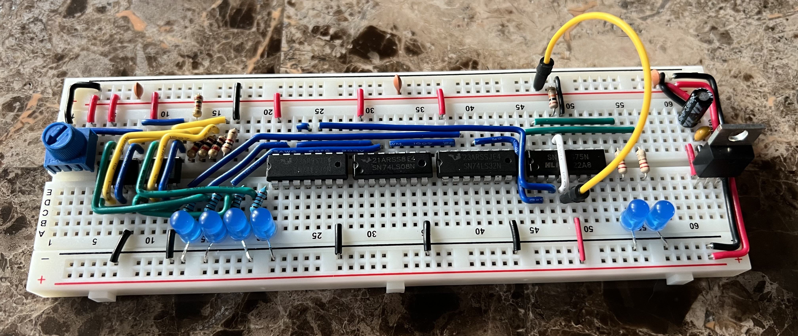

# Implementation of an Analog-to-Digtal Converter (ADC) using discrete components and Integrated Circuits (IC)

## Roadmap
- Flash Analog-to-Digital Converter
- [ ] 2-bit ADC 
    - [X] Breadboard Implementation
    - [X] Altium Schematic
- [ ] 4-bit ADC 
    - [ ] Altium Schematic
    - [ ] Final PCB Product
- SAR Analog-to-Digital Converter
- [ ] 2-bit ADC 
    - [ ] Breadboard Implementation
    - [ ] Altium Schematic
- [ ] 4-bit ADC 
    - [ ] Altium Schematic
    - [ ] Final PCB Product

## Table of Contents
1. [Objectives or Purpose](#objectives-or-purpose)
2. [Preliminary Design](#preliminary-design)
3. [Hardware schematic](#hardware-schematic)
4. [Software flow chart or algorithms](#software-flow-chart-or-algorithms)
5. [Debugging](#debugging)
6. [Testing methodology or results](#testing-methodology-or-results)
7. [Observations and Conclusions](#observations-and-conclusions)
8. [Documentation](#documentation)
 
### Objectives or Purpose
In this project, I will go over my implementation to create an ADC from scratch which will be used with an Arduino Uno to read the data in. I first plan to design a 2-bit Flash ADC then increase the 
resolution to 4-bit. Another implementation is the SAR ADC which will be my next design starting with 2-bit resolution then increasing to 4-bit. After the 4-bit designs have been tested on breadboards and have no issues, 
I will move the product from the breadboard to a Printed Circuit Board (PCB).

### Preliminary design
The first design of the Flash ADC will have a 2-bit resolution. The ADC will take an analog signal in and output to a priority encoder to produce a weighted binary output. This output will be read with an 
Arduino Uno to determine the analog voltage. Below is the architecture of the 2-bit Flash ADC.

A Flash ADC will use a resistive ladder, comparators and a Priority Encoder to read the analog voltage and output a weighted binary value. An enable pin will be active high nominally. Once the device reading in the weighted binary value is ready, it will set the enable pin low to hold the current value using a latch. The ADC Logic will have a resistor ladder used as the voltage divider. 
Each node on the ladder will be the input to the non-inverting side of an operational amplifier. Although a comparator IC could be used here, I do not plan to use the ADC in a high frequency design. Therefore 
the LM358N Op-Amp can substitue the need for a comparator. Some other drawbacks in using the LM358N are discussed in [Debugging](#debugging). The Priority Encoder will take the unweighted binary value from the LM358N and use combinational logic to output a weighted binary value for the Arduino Uno to read in. For a 2-bit ADC, the resolution is one part in 3 (22-1) which is not very useful. The Arduino Uno has a 10-bit ADC which has 1023 levels. Although the internal will need 2n-bits between the ADC Logic and the Priority Encoder, we reduce the number of lines out back to n-bits, in our case 2-bits.

Within the Flash ADC, the Priority Encoder will first be designed. The ADC Logic will be designed later in Altium in Section [Hardware schematic](#hardware-schematic). With the Priority Encoder taking in 4 bits and outputting 2 bits, created below is the Truth Table with inputs x[3..0] and outputs y[1..0]. Note that only the realized outputs are shown in the table as others are not possible and considered as don't cares (X). In any combination where the higher bits are '1' then all lower bits must also be '1' as the resistor ladder will have lower potential nodes already lactive.  

Given the truth table, we can draw a 4 variable Karnaugh Map (K-Map) for both outputs. Shown below in the 2-bit Priority Encoder K-Map, we can use the don't cares in our combinational logic design because they will never be an outcome in the ADC Logic. Being able to do this, we can decrease the number of logic gates used. This decreases the cost of the design as well as the critical path when considering propagation delay.

By including 'X' in the K-Map grouping, we end up only using 3 logic gates shown below for the 2-bit ADC. 

Given the design of the Priority Encoder, we will next use this design alongside the Flash ADC resistive ladder and Op-Amps to create the hardware schematic. Included will be supplemental discrete components such as coupling capacitors and a voltage regulator. 

### Hardware schematic
<!-- can be left for PCB Schematic !>> -->

### Software flow chart or algorithms
<!-- Not at stage of product where Arduino has been implemented. !>> -->

### Debugging
This section goes over the various issues I had throughout the project and how I resolved the problem. Not everything will work out as expected and being able to troubleshoot an issues gives you an excersise to determine if you actually know what you are doing. For example, the first issue I had came about when I was created my 2-bit Flash ADC on the breadboard. When I completed the comparator ADC Logic that took in a certain voltage from the resistive ladder, I was getting a different output than what was expected. Although my input voltage was lower than all voltage references on the resistive ladder, I saw a high voltage output from the op-amp used as the MSB. Although all other op-amps were firing as expected in referenc to the input voltage, I took me some time to determine what the issue was. Using the LM358N Operational Amplifier as my comparator in the ADC Logic, I noticed in the datasheet that the LM358N is not a Rail-to-Rail In IC. The highest input voltage allowed is 1.5V less than Vcc which for a 5V Supply allows for a max input of 3.5V. Since I had an abudance of the LM358N ICs, I went ahead and used them instead of buying more chips for the project. I do see there being a possibility later in the future where I go back and change the LM358N to a different chip that is Rail-to-Rail but for the time being I will leave it as is. However, I cannot leave the resistor ladder unchanged. Because the MSB comparator must be less than 3.5V I doubled the value of the top resistor and left the rest of the values unchanges. For a 5V Supply and a Req for the resistive ladder at 6 k&#8486; gives a current of 0.83 mA. So the voltage drop at the top resistor is 0.83 mA * 2 k&#8486; = 1.67V which is in the range of the max allowed input voltage of 3.5V.

When designing the 4-bit Flash ADC, using a K-Map was an obvious no as they already become a hastle to solve for 5 and 6 variables. As the 4-bit Flash ADC was going to have 16 variables into the priority encoder, I had to look elsewhere. I did consider using the Quine-McCluskey Method since it could hand way more variables than a K-Map. But considering space constraints and unnecessary complexity that would be added to the project, I decided to us a different approach. The SN74LS148N is an 8-to-3 line priority encoder which could be cascaded and create a 16-to-4 line encoder. At the time of writing this, I am sill in the process of working this out
    

### Testing methodology or results

[2-bit_Flash_ADC_Breadboard](https://youtu.be/kl4At6pt9WI)

### Observations and Conclusions

### Documentation
<!-- parts list? !>> -->
