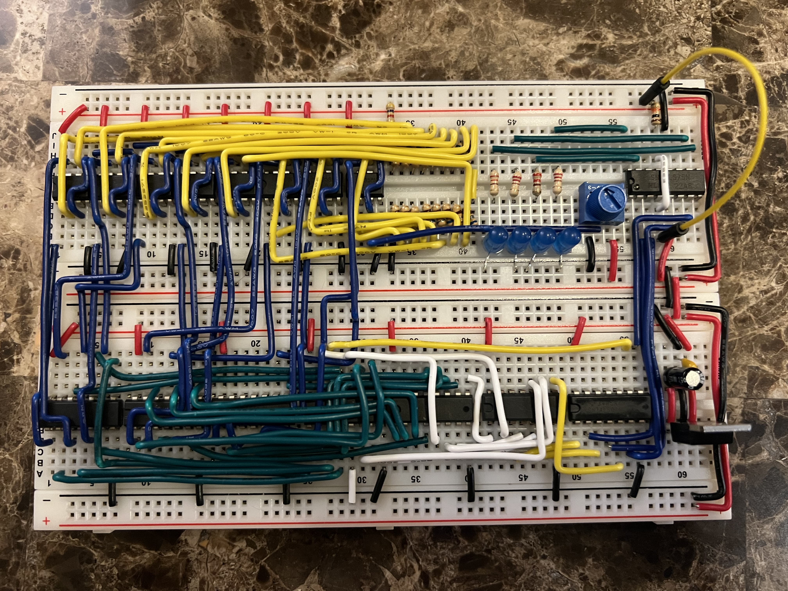

# ADC and DAC Design

In this repository you will find my implementation of an ADC and DAC. After preliminary designs, breadboard prototypes are tested on a breakboard then to a PCB created within Altium. The ADC will be implemented in 2 different designs. First, creating a Flash ADC with 2-bit resolution. After testing, the design will be upgraded to 4-bit resolution and finalized onto a PCB. The second implementation will be the SAR ADC which will move through the same objectives as the Flash ADC. The DAC will be worked on between the two ADC designs as the SAR ADC uses a DAC to determine the analog voltage level. 

## Table of Contents
* [Analog-to-Digital Converter (ADC) Design](https://github.com/J0NTrollston/ADC-and-DAC-Design/tree/main/ADC_Design)
* [Digital-to-Analog Converter (DAC) Design (not yet implemented)](https://github.com/J0NTrollston/ADC-and-DAC-Design/tree/main/DAC_Design)

## Project-wide Roadmap
- Flash Analog-to-Digital Converter
- [X] 2-bit ADC 
    - [X] Breadboard Implementation
    - [X] Altium Schematic
- [ ] 4-bit ADC 
    - [X] Breadboard Implementation
    - [ ] Altium Schematic
    - [ ] Final PCB Product
- Digital-to-Analog Converter
- [ ] 2-bit DAC
    - [ ] Breadboard Implementation
    - [ ] Altium Schematic
- [ ] 4-bit DAC 
    - [ ] Altium Schematic
    - [ ] Final PCB Product
- SAR Analog-to-Digital Converter
- [ ] 2-bit ADC 
    - [ ] Breadboard Implementation
    - [ ] Altium Schematic
- [ ] 4-bit ADC 
    - [ ] Altium Schematic
    - [ ] Final PCB Product

## Demos
[2-bit Flash ADC Breadboard Demo](https://youtu.be/kl4At6pt9WI)

[4-bit Flash ADC Breadboard Demo](https://youtu.be/iKHJjdzjozc)